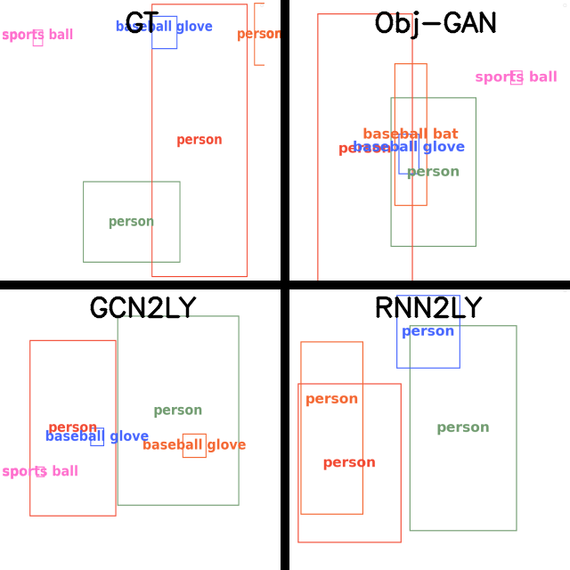
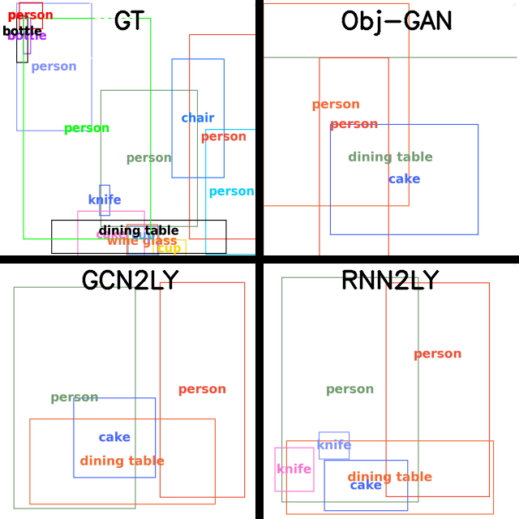

# Text To Layout

Text-to-layout using graph convolutional neural network (GCNN) or recurrent neural network (RNN).

Further information of the project can be found on: https://drive.google.com/file/d/1HZIBCutbvoDOcpghDzUTmfn9fKN1kr_s/view?usp=sharing

Transformer version comming soon.

## Libraries
The code has been tested using Python 3.8.8 and pytorch 1.7.1.

Other libraries needed:
- tqdm (tested on 4.58.0)
- NumPy (tested on 1.19)
- nltk (tested on 3.5)

## Dataset
Download and save the data in ./GCN2LY or ./RNN2LY folder:

https://drive.google.com/file/d/1FQC2yEV6--yM2ejsOsILR7pOTeTknLmE/view?usp=sharing

The data contains:
- datasets: A folder containing the following datasets:
  - AMR2014: Training and Testing datasets with the captions unprocessed.
  - AMR2014train-dev-test: Training, development and testing datasets with the captions processed.
  - COCO-annotations: MSCOCO2014 training and testing annotations.
- text_encoder100.pth: Pretrained text encoder (DAMSM).
- captions.pickle: Vocabulary of the pretrained encoder.

## Training

To train the model you need to set up the following variables in *main.py* file:

- *IS_TRAINING*: True.
- *EPOCHS*: Number of epochs to train.
- *CHECKPOINTS_PATH*: The path to save the checkpoints (remember to create the folder before).

Additionally, you can set up the following variables to save the outputs of the development dataset.
- *SAVE_OUTPUT*: True.
- *VALIDATION_OUTPUT*: Path to store the output (remember to create the folder before).

For testing the training process is recommended to set the variable *UQ_CAP* in *main.py* to True.

## Testing
To test the model you need to set up the following variables in *main.py* file:

- *IS_TRAINING*: False.
- *EPOCH_VALIDATION*: The epoch number to validate.
- *VALIDATION_OUTPUT*: Path to store the output (remember to create the folder before).
- *SAVE_OUTPUT*: True.

## Pretrained model

GCN2LY and RNN2LY checkpoints

https://drive.google.com/file/d/18_R-d3fPoqEKypZPI8O4TOYoixT9uOkb/view?usp=sharing

All of them trained using a hidden size of 256 and 10 objects for 30 epochs.

PT stands for pretrained RNN encoder.

FT stands for pretrained and fine-tuned RNN encoder.

## Metrics

To understand the metrics check chapter 5: https://drive.google.com/file/d/1HZIBCutbvoDOcpghDzUTmfn9fKN1kr_s/view?usp=sharing

| System        | RSCP↑  | AR↓    | RS↓       | P↑      | F1↑    | R↑      | P@0.3↑ | P@0.5↑ | R@0.5↑ | R@0.5↑ |
|---------------|--------|--------|-----------|---------|--------|---------|--------|--------|--------|--------|
| Obj-GAN       | 0.348  | 0.246  | 2216.491  | 0.866   | 0.566  | 0.499   | 0.257  | 0.094  | 0.227  | 0.073  |
| GCN2LY        | 0.449  | 0.191  | 7.540     | 0.893   | 0.594  | 0.520   | 0.362  | 0.172  | 0.286  | 0.159  |
| RNN2LY        | 0.459  | 0.191  | 7.503     | 0.910   | 0.606  | 0.529   | 0.360  | 0.171  | 0.295  | 0.165  |
| RNN2LY_PT     | 0.464  | 0.188  | 7.587     | 0.907   | 0.609  | 0.534   | 0.358  | 0.171  | 0.291  | 0.164  |
| RNN2LY_FT     | 0.459  | 0.190  | 7.478     | 0.911   | 0.606  | 0.529   | 0.364  | 0.173  | 0.296  | 0.167  |

PT stands for pretrained RNN encoder.

FT stands for pretrained and fine-tuned RNN encoder.

## Examples

The ground truth (GT) and [Obj-Gan](https://github.com/jamesli1618/Obj-GAN) are used to compare the results.

### A group of people sit around a table. MSCOCO image ID: 10986.

### A man sliding into a base next to another baseball player. MSCOCO image ID: 515982.

### A woman sitting with a boy cutting a cake. MSCOCO image ID: 194097.

## Information about the project
- Type of project: End of degree project.
- Author: Carlos Domínguez Becerril.
- Supervisors: Gorka Azkune Galparsoro and Oier López de Lacalle Lecuona.

